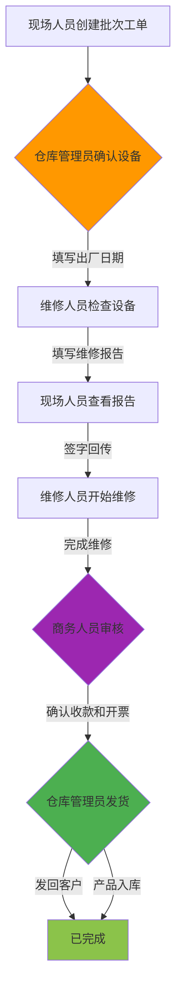

# 维修工单系统 - 完整工作流程 v2.0

## 🎉 欢迎使用工作流程 v2.0

本版本实现了一个完整的9步工作流程系统，涉及4个角色，每个环节都有明确的责任人和专用操作界面。

---

## 📚 文档导航

### 快速开始

1. **[数据库更新脚本](./DATABASE_SCHEMA_UPDATE.md)** ⭐ 必读
   - 包含所有新增字段的SQL脚本
   - 一键执行升级脚本：`database/workflow_v2_upgrade.sql`
   - 验证脚本和回滚方案

2. **[工作流程详细说明](./COMPLETE_WORKFLOW_SYSTEM.md)** ⭐ 必读
   - 9步完整流程图
   - 每个步骤的详细说明
   - API端点总结
   - 界面组件介绍

3. **[测试指南](./WORKFLOW_TEST_GUIDE.md)** ⭐ 必读
   - 完整测试流程（从创建到完成）
   - 异常流程测试（取消工单）
   - 常见问题排查

### 用户手册

4. **[用户角色操作指南](./USER_ROLE_GUIDE.md)**
   - 现场人员操作指南 👷
   - 仓库管理员操作指南 📦
   - 维修人员操作指南 🔧
   - 商务人员操作指南 💰

### 技术文档

5. **[更新摘要](./UPDATE_SUMMARY_V2.md)**
   - 核心改进总览
   - 技术亮点
   - 部署清单
   - 兼容性说明

---

## 🚀 快速部署（3步）

### 第1步：更新数据库

```bash
# 进入项目目录
cd d:/MY\ app/axiom-repair

# 运行升级脚本（请先修改脚本中的数据库名）
sqlcmd -S your_server -d your_database -i database/workflow_v2_upgrade.sql
```

**预期输出**：
```
✅ ManufactureDate - 出厂日期
✅ WarrantyStatus - 保修状态
✅ WarehouseConfirmedAt - 仓库确认时间
...（共12个字段）
✅ 所有必需字段都已存在！
```

---

### 第2步：部署应用代码

```bash
# 安装依赖
npm install

# 构建应用
npm run build

# 启动应用
npm start
```

---

### 第3步：测试验证

按照 [测试指南](./WORKFLOW_TEST_GUIDE.md) 进行完整流程测试：

```
✅ 现场人员创建批次工单
✅ 仓库管理员确认设备并填写出厂日期
✅ 维修人员检查设备并填写报告
✅ 现场人员签字回传
✅ 维修人员完成维修
✅ 商务人员审核
✅ 仓库管理员发货
✅ 验证已完成状态
```

---

## 🎯 核心功能速览

### 1️⃣ 仓库管理员 - 确认设备并填写出厂日期

**入口**: `/warehouse/dashboard` → 待确认批次

**功能**：
- 查看待确认的批次列表
- 为每台设备填写出厂日期
- 系统自动计算保修状态（保内/过保）
- 确认后，维修人员即可开始处理

**界面截图**：
```
┌─────────────────────────────────┐
│ 仓库确认批次设备                 │
│ 批次号：WO2602259788 | 2台设备  │
├─────────────────────────────────┤
│ 设备1: TEST001                  │
│ 出厂日期: [2024-06-15] ✅       │
│                                 │
│ 设备2: TEST002                  │
│ 出厂日期: [2024-07-20] ✅       │
│                                 │
│         [确认批次设备 (2台)]     │
└─────────────────────────────────┘
```

---

### 2️⃣ 维修人员 - 查看出厂日期并完成维修

**入口**: `/batch/[id]` → 批次详情页

**新增功能**：
- ✅ 设备列表显示出厂日期和保修状态
- ✅ 仓库未确认时，禁用编辑按钮
- ✅ 维修进行中时，显示"完成维修"按钮
- ✅ 完成后自动流转至商务审核

**界面显示**：
```
设备列表
┌────────────────────────────────────────────┐
│ 序号 序列号  型号  出厂日期    保修状态 状态│
│  1  TEST001 NC100 2024-06-15  保内✅  维修中│
│  2  TEST002 NC100 2024-07-20  保内✅  维修中│
└────────────────────────────────────────────┘
```

---

### 3️⃣ 商务人员 - 确认收款和开票

**入口**: `/business` → 待审核批次

**功能**：
- 查看待审核的批次列表
- 确认是否收费
- 填写维修费用和客户名称
- 确认收款（收费项目必填）
- 确认开票（选填）
- 审核通过后流转至仓库发货

**审核界面**：
```
┌─────────────────────────────────┐
│ 💰 收款与开票确认                │
├─────────────────────────────────┤
│ 是否需要收费:  [开关: 是] ✅    │
│                                 │
│ [如果收费 = 是]                  │
│ 维修总费用: 1000元 *             │
│ 客户名称: 广州分公司             │
│ 是否已收款: [开关: 是] ✅ *      │
│ 是否已开票: [开关: 是] ✅        │
│                                 │
│           [完成审核]             │
└─────────────────────────────────┘
```

---

### 4️⃣ 仓库管理员 - 出库发回或入库

**入口**: `/warehouse/dashboard` → 待发货批次

**功能**：
- 查看待发货的批次列表
- 选择发货方式：
  - **发回客户**：填写快递信息
  - **产品入库**：无需快递信息
- 完成后批次工单结束

**发货界面**：
```
┌─────────────────────────────────┐
│ 🚚 发货方式                      │
├─────────────────────────────────┤
│ ● 发回客户                       │
│   设备已维修完成，发回给客户      │
│                                 │
│   发货日期: [2026-02-26]        │
│   快递单号: SF1234567890        │
│   发货数量: 2                   │
│                                 │
│ ○ 产品入库                       │
│   设备暂不发回，先入库存储        │
│                                 │
│           [确认发货]             │
└─────────────────────────────────┘
```

---

## 📋 完整流程图



---

## 🔑 关键特性

### 1. 出厂日期管理

- 仓库管理员必须填写每台设备的出厂日期
- 系统自动计算保修状态（保内/过保）
- 维修人员可以查看出厂日期和保修状态
- 保修状态影响收费决策

### 2. 状态可视化

每个批次详情页都显示：
- ✅ 9步流程时间线
- ✅ 当前步骤高亮显示
- ✅ 已完成步骤显示绿色打勾
- ✅ 未来步骤显示灰色

### 3. 权限精细控制

不同角色在不同状态下看到不同的按钮：
- ✅ 仓库未确认 → 维修人员无法编辑
- ✅ 维修进行中 → 显示"完成维修"按钮
- ✅ 商务审核中 → 只有商务人员可以操作
- ✅ 待发货 → 只有仓库管理员可以操作

### 4. 审计追踪

每个关键操作都记录：
- ✅ 谁操作的（`...By` 字段）
- ✅ 什么时间（`...At` 字段）
- ✅ 便于追溯和审计

---

## 📊 数据库变化

### 新增字段（12个）

| 字段组 | 字段数 | 用途 |
|-------|-------|-----|
| 出厂日期和保修 | 4 | 管理出厂日期、保修状态、仓库确认 |
| 维修完成 | 2 | 记录维修完成时间和人员 |
| 商务审核 | 2 | 记录商务审核时间和人员 |
| 仓库发货 | 3 | 记录发货方式、时间和人员 |
| 现场确认 | 1 | 记录现场签字确认时间 |

**详见**：`DATABASE_SCHEMA_UPDATE.md`

---

## 🎨 界面优化

### 批次详情页状态提示

根据不同状态显示不同颜色的提示框：

| 状态 | 提示颜色 | 提示内容 |
|-----|---------|---------|
| `Warehouse_Confirming` | 🟠 橙色 | 等待仓库管理员确认 |
| `Warehouse_Confirmed` | 🔵 蓝色 | 仓库已确认，可以开始检查 |
| `Pending_Reporter_Confirm` | 🔷 青色 | 等待现场人员签字确认 |
| `Technician_Repairing` | 🟣 靛蓝 | 现场已签字，可以开始维修 |
| `Business_Review` | 🟣 紫色 | 等待商务人员审核 |
| `Warehouse_Shipping` | 🟢 绿色 | 等待仓库管理员发货 |
| `Completed` | ✅ 绿色 | 批次工单已完成 |

---

## 📱 响应式设计

所有新界面都支持：
- ✅ 桌面端（大屏幕）
- ✅ 平板端（中屏幕）
- ✅ 移动端（小屏幕）

时间线组件特别优化：
- 桌面端：横向滚动，紧凑显示9个步骤
- 移动端：垂直布局，清晰展示每个步骤

---

## 🔧 技术栈

- **前端**: Next.js 14 + TypeScript + Tailwind CSS
- **UI库**: Shadcn UI
- **数据库**: SQL Server (mssql)
- **状态管理**: React Hooks
- **日期处理**: date-fns
- **通知**: sonner (toast)

---

## 📦 文件结构

```
axiom-repair/
├── components/
│   ├── warehouse-batch-confirm.tsx        # 仓库确认组件
│   ├── business-batch-review.tsx          # 商务审核组件
│   ├── warehouse-batch-shipping.tsx       # 仓库发货组件
│   ├── batch-work-order-detail.tsx        # 批次详情（已优化）
│   └── repair-status-timeline.tsx         # 时间线（已扩展）
├── app/
│   ├── api/tickets/
│   │   ├── warehouse-pending-batches/     # 待确认批次
│   │   ├── warehouse-confirm-batch/       # 确认批次
│   │   ├── warehouse-shipping-batches/    # 待发货批次
│   │   ├── warehouse-shipping-batch/      # 完成发货
│   │   ├── business-pending-batches/      # 待审核批次
│   │   ├── business-confirm-batch/        # 商务审核
│   │   └── complete-repair-batch/         # 完成维修
│   ├── warehouse/dashboard/               # 仓库工作台（已优化）
│   └── business/                          # 商务工作台（已优化）
├── lib/
│   └── enums.ts                           # 状态枚举（已更新）
├── database/
│   └── workflow_v2_upgrade.sql            # 数据库升级脚本
└── docs/
    ├── README_WORKFLOW_V2.md              # 本文件
    ├── COMPLETE_WORKFLOW_SYSTEM.md        # 完整流程说明
    ├── WORKFLOW_TEST_GUIDE.md             # 测试指南
    ├── USER_ROLE_GUIDE.md                 # 用户操作指南
    ├── DATABASE_SCHEMA_UPDATE.md          # 数据库更新
    └── UPDATE_SUMMARY_V2.md               # 更新摘要
```

---

## 🎓 学习路径

### 对于系统管理员

1. 阅读 [数据库更新脚本](./DATABASE_SCHEMA_UPDATE.md)
2. 执行 `database/workflow_v2_upgrade.sql`
3. 验证字段完整性
4. 部署应用代码

### 对于产品经理

1. 阅读 [完整工作流程说明](./COMPLETE_WORKFLOW_SYSTEM.md)
2. 了解9步流程的设计思路
3. 查看界面组件截图
4. 规划用户培训计划

### 对于测试人员

1. 阅读 [测试指南](./WORKFLOW_TEST_GUIDE.md)
2. 准备测试账号（4个角色）
3. 执行完整流程测试
4. 填写测试报告

### 对于最终用户

1. 阅读 [用户角色操作指南](./USER_ROLE_GUIDE.md)
2. 找到自己角色对应的章节
3. 按照操作步骤使用系统
4. 遇到问题查看"常见问题排查"

---

## ❓ 常见问题

### Q1: 为什么要添加仓库确认环节？

**A**: 仓库确认环节确保：
- ✅ 设备信息准确无误
- ✅ 出厂日期完整填写
- ✅ 保修状态正确计算
- ✅ 维修人员拿到准确的设备信息

---

### Q2: 出厂日期有什么用？

**A**: 出厂日期用于：
- ✅ 自动计算保修状态（保内/过保）
- ✅ 决定是否需要收费
- ✅ 保内免费，过保收费
- ✅ 维修人员可以快速判断维修方案

---

### Q3: 商务审核环节做什么？

**A**: 商务审核负责：
- ✅ 确认是否需要收费
- ✅ 确认客户是否已付款
- ✅ 确认是否已开具发票
- ✅ 收费项目必须确认收款才能通过

---

### Q4: 为什么要区分"发回客户"和"产品入库"？

**A**: 两种方式适用不同场景：
- **发回客户**：设备已修复，正常发回
- **产品入库**：设备暂不发回，先入库存储
  - 可能原因：客户暂时不需要
  - 可能原因：设备需要等待其他配件
  - 可能原因：批量维修，统一发货

---

### Q5: 旧的工单数据会受影响吗？

**A**: 不会！
- ✅ 旧状态自动映射到新状态
- ✅ 已完成的工单不受影响
- ✅ 可以选择性地为旧数据补充出厂日期

---

## 🆘 获取帮助

### 技术支持

- 📧 邮件：[待填写]
- 💬 微信：[待填写]
- 📞 电话：[待填写]

### 反馈建议

如有任何问题或建议，请联系：
- 产品经理：[待填写]
- 技术负责人：[待填写]

---

## 📅 版本历史

### v2.0.0 (2026-02-25)

**新增功能**：
- ✅ 9步完整工作流程
- ✅ 仓库确认环节（填写出厂日期）
- ✅ 商务审核环节（确认收款和开票）
- ✅ 仓库发货环节（发回或入库）
- ✅ 出厂日期和保修状态管理
- ✅ 9步流程时间线
- ✅ 状态动态提示和操作指引

**优化改进**：
- ✅ 权限控制更精细
- ✅ 状态流转更清晰
- ✅ 用户体验更友好
- ✅ 审计追踪更完整

---

## 🎉 开始使用

现在就开始部署和测试吧！

1. ⬆️ **[更新数据库](./DATABASE_SCHEMA_UPDATE.md)**
2. 🚀 **部署应用代码**
3. 🧪 **[运行测试](./WORKFLOW_TEST_GUIDE.md)**
4. 📖 **[查看用户指南](./USER_ROLE_GUIDE.md)**

---

**最后更新**: 2026-02-25  
**版本**: v2.0.0  
**作者**: AI Assistant  
**状态**: ✅ 已完成开发，待部署测试
